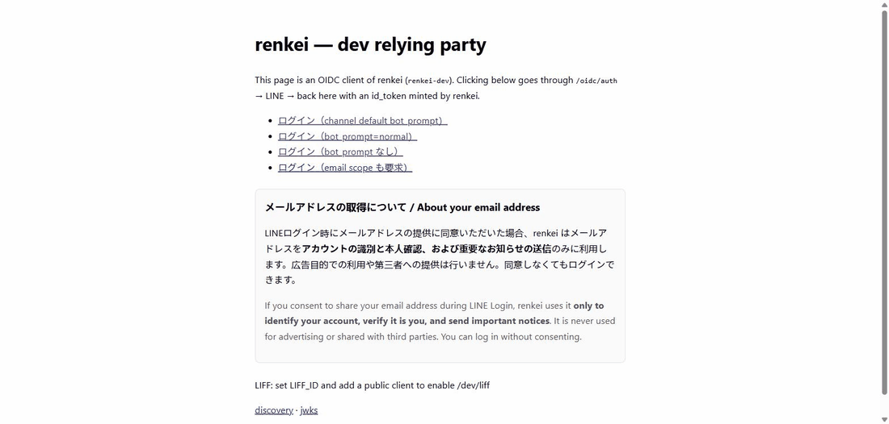

# renkei (連携)

> 日本語: [README.md](README.md) · Docs: [docs/](docs/) · Status: **v0.1 in progress** (pre-release)

**A self-hosted identity broker that owns everything after the LINE login.**

Getting a "Log in with LINE" button is solved — Auth0, Clerk and Logto all do it. What comes *after* is not.
renkei takes on the LINE-specific plumbing and exposes plain **OpenID Connect** on the other side.
Point Supabase, Firebase, Cognito, Keycloak or your own app at it.

```
LINE Platform ──────▶  renkei (self-hosted)  ──────▶  Supabase / Keycloak / Cognito / your app
 LINE Login              friend-add (bot_prompt)          standard OIDC + line:* claims
 LIFF / Mini App         LIFF token exchange              Keycloak-compatible paths too
 Messaging API           ID mapping, friendship
```

## What renkei does

| | renkei | Auth0 | Clerk | Logto | Cognito | DIY |
|---|:-:|:-:|:-:|:-:|:-:|:-:|
| LINE Login | ✅ | ✅ | ✅ | ✅ | manual OIDC | ✅ |
| Friend-add at login (`bot_prompt`) + friendship status | ✅ | Management API hack | ✗ | ✗ | ✗ (can't pass it) | yourself |
| LIFF / Mini App tokens verified server-side → session | ✅ `POST /liff/exchange` | ✗ | ✗ | ✗ | ✗ | yourself |
| Messaging API account linking (linkToken / nonce / webhook) | v0.2 | ✗ | ✗ | ✗ | ✗ | yourself |
| One `sub` across LINE Login / LIFF / Messaging user IDs | ✅ | ✗ | ✗ | ✗ | ✗ | yourself |
| One channel per country (JP / TW / TH) | ✅ multiple in config | multiple connections | ✗ | ✗ | ✗ | yourself |
| Email (id_token-only, needs permission, silently dropped) | ✅ correct + boot-time warning + placeholder | △ | △ | △ | △ | yourself |
| Use from Supabase | ✅ via the built-in Keycloak provider | — | — | — | — | — |
| Self-hosted / open source | ✅ Apache-2.0 | ✗ | ✗ | ✅ | ✗ | ✅ |

## Live demo

**<https://renkei-demo.onrender.com/dev>** — "LINEでログイン" → friend-add screen → an id_token with `line:*` claims, right there. You log in with your own LINE account (the only side effect is one row in the demo DB mapping to your LINE user ID).



> **Free-hosting caveat (Render Free + Neon Free)**: the instance sleeps after 15 idle minutes, so **the first request can take up to a minute**. It can also **return 404 or not respond at all** for reasons on the hosting side. That is not a renkei bug — wait a bit and reload, or run it locally with "Try it in 5 minutes" below (which is the real experience).

## Try it in 5 minutes

Prerequisite: in the LINE Developers Console, a **provider → LINE Login channel** (ideally with a linked Messaging API channel).
First time? Read the [LINE Developers Console guide](docs/guides/line-console.en.md).

```sh
mkdir renkei && cd renkei
npx renkei init             # writes .env (signing keys, cookie keys, SQLite); paste the channel ID and secret
npx renkei                  # Node 22.13+, no database server
```

Or with Docker:

```sh
git clone https://github.com/AchrafReyani/renkei && cd renkei
cp .env.example .env        # set LINE_LOGIN_CHANNEL_ID / LINE_LOGIN_CHANNEL_SECRET
docker compose up           # renkei + Postgres
```

Open http://localhost:3000/dev → "Log in with LINE" → LINE consent → friend-add →
you get the id_token renkei minted (`line:user_id`, `line:friend`, `line:channel_id`, …).

Register `http://localhost:3000/line/callback` as a Callback URL on the channel first.

## Using it

### 1. From your app (as a standard OIDC client)

renkei is an OpenID Connect provider. Discovery: `http(s)://<renkei>/.well-known/openid-configuration`.
Register a client with `npx renkei add-client my-app --redirect <callback URL> --preset authjs` (adds it to `RENKEI_CLIENTS` and prints the app-side config).

```ts
// e.g. Auth.js (next-auth) generic OIDC provider
{
  id: 'renkei', name: 'LINE', type: 'oidc',
  issuer: 'https://auth.example.com',
  clientId: 'my-app', clientSecret: process.env.RENKEI_CLIENT_SECRET,
  authorization: { params: { scope: 'openid profile email line' } },
}
```

The `line` scope adds `line:user_id` / `line:friend` / `line:channel_id` / `line:region` to the id_token and userinfo.
→ [Next.js tutorial](docs/tutorials/nextjs.en.md)

For a Next.js app without Auth.js there is **`renkei-next`**: route handlers, an encrypted session, a `proxy.ts` guard and a LINE-guideline-compliant `<LineLoginButton />` (`npx renkei add-client … --preset next`). → [renkei-next reference](docs/reference/next.en.md)

### 2. From Supabase

Enter renkei's URL in Supabase Auth's built-in **Keycloak** provider. Works in the local CLI too.
→ [Supabase tutorial](docs/tutorials/supabase.en.md)

### 3. From a LIFF app / LINE Mini App

The front-end sends `liff.getIDToken()` / `liff.getAccessToken()` to renkei — never profile JSON.

```ts
const res = await fetch('https://auth.example.com/liff/exchange', {
  method: 'POST', headers: { 'content-type': 'application/json' },
  body: JSON.stringify({ id_token: liff.getIDToken(), access_token: liff.getAccessToken(), client_id: 'my-liff-app' }),
})
const { id_token } = await res.json()   // signed by renkei (RS256, verifiable via JWKS)
```

### 4. With the SDK (`renkei-client`)

If you would rather not hand-assemble URLs and requests, use the zero-dependency `renkei-client` (browsers / Node / Workers).

```ts
import { createRenkeiClient, generatePkce, randomString } from 'renkei-client';

const renkei = createRenkeiClient({ issuer: 'https://auth.example.com', clientId: 'my-app' });

// Start an OIDC login (keep state / nonce / verifier in your session, compare on return)
const state = randomString(), nonce = randomString(), { verifier, challenge } = await generatePkce();
location.href = renkei.loginUrl({ redirectUri: 'https://app.example.com/cb', state, nonce, codeChallenge: challenge, botPrompt: 'normal' });

// LIFF: LINE tokens → renkei id_token with typed line:* claims
const { idToken, claims } = await renkei.exchangeLiffToken({ idToken: liff.getIDToken(), accessToken: liff.getAccessToken() });

// Session-cookie mode (RENKEI_SESSION_COOKIE=true)
const me = await renkei.session(); // RenkeiClaims | null
```

→ [Client SDK reference](docs/reference/client.en.md)

## Configuration

Environment variables (`.env`). Full reference: [config](docs/reference/config.en.md).

| Variable | Meaning |
|---|---|
| `ISSUER` | renkei's public URL (= OIDC issuer) |
| `LINE_LOGIN_CHANNEL_ID` / `LINE_LOGIN_CHANNEL_SECRET` | LINE Login channel |
| `LINE_LOGIN_REGION` | `jp` / `tw` / `th` … (default `jp`) |
| `RENKEI_BOT_PROMPT` | `aggressive` / `normal` / `none` (default `aggressive`) |
| `RENKEI_REQUEST_EMAIL` | `true` to request the email scope (channel needs email permission) |
| `RENKEI_CLIENTS` | JSON array of downstream clients (`clientId`, `clientSecret`, `redirectUris`, `placeholderEmailDomain`, …) |
| `RENKEI_COOKIE_KEYS` | cookie signing keys (comma-separated, rotatable) |
| `RENKEI_JWKS` | token signing keys (JSON array of JWKs); generated per boot if unset (dev only) |
| `DATABASE_URL` | `postgres://…` or `sqlite:./data/renkei.db` (Node 22.13+ built-in SQLite, zero dependencies); in-memory if unset (dev only). On Cloudflare Workers a D1 binding takes its place ([guide](docs/guides/deploy-cloudflare-workers.en.md)) |

## Endpoints

| Path | Role |
|---|---|
| `/.well-known/openid-configuration`, `/oidc/jwks` | discovery, public keys |
| `/oidc/auth`, `/oidc/token`, `/oidc/me`, `/oidc/token/revocation` | OIDC |
| `/protocol/openid-connect/{auth,token,userinfo,certs}` | Keycloak-compatible aliases (Supabase etc.) |
| `/liff/exchange` | LIFF / Mini App token exchange |
| `/line/callback` | where LINE returns to (register this URL in the console) |
| `/healthz` | health check |

→ [Endpoints and claims reference](docs/reference/endpoints.en.md)

## Runtimes

Node.js 22+. The same code is verified on **Node / Docker, Deno, Cloudflare Workers and Supabase Edge Functions**. Cloudflare Workers is a supported target with D1 storage (`renkei-server/workers`, [deploy guide](docs/guides/deploy-cloudflare-workers.en.md))
([spike record](docs/SPIKE-oidc-provider-runtimes.md)). v0.1 ships a Docker image and npm packages; v0.3 packages the edge deploys.

## Non-goals

- Not a general-purpose IdP — passwords, MFA, RBAC belong to Logto or Keycloak; renkei sits **in front** of them
- Not a marketing tool — friendship is exposed **as a claim**; renkei never sends messages
- No hosted offering in v0.x

## Roadmap

[docs/ROADMAP.md](docs/ROADMAP.md). v0.2: Messaging API account linking. v0.3: edge deploys and SDKs. Then Taiwan/Thailand docs.

## Contributing

Japanese or English. See [CONTRIBUTING.md](CONTRIBUTING.md).
Design reasoning in [docs/DECISIONS.md](docs/DECISIONS.md), structure in [docs/ARCHITECTURE.md](docs/ARCHITECTURE.md).

## License

Apache-2.0

---

renkei is an independent project, not affiliated with LY Corporation. "LINE" is a trademark of LY Corporation.
Follow the [LINE Login button design guidelines](https://developers.line.biz/en/docs/line-login/login-button/) when placing a login button.
