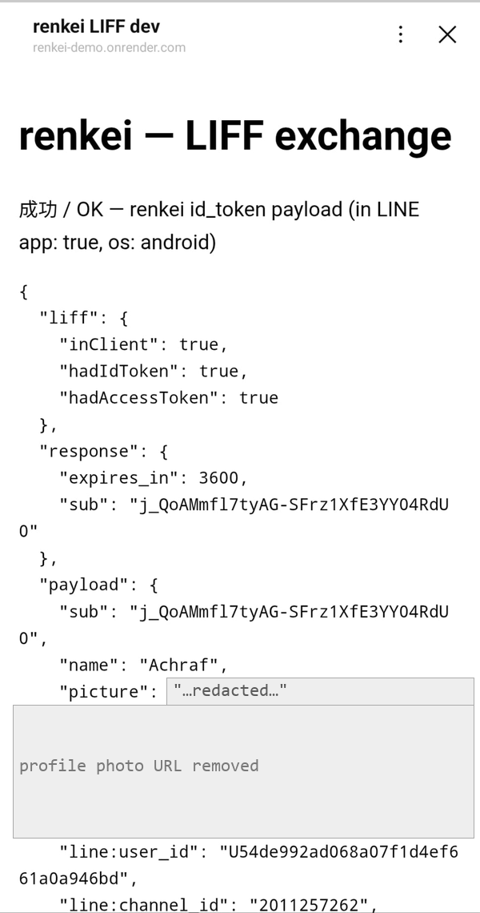

# renkei（連携）

> English: [README.en.md](README.en.md) · ドキュメント: [docs/](docs/) · 状況: **v0.1 開発中**（公開前）

**LINEログインの「その先」を全部引き受ける、セルフホスト型IDブローカー。**

LINEでログインさせるだけなら Auth0 でも Clerk でも Logto でもできます。できないのはその先です。
renkei は LINE 固有の面倒をすべて引き受け、反対側には**標準の OpenID Connect** を出します。
Supabase・Firebase・Cognito・Keycloak・自前アプリに、そのまま繋がります。

```
LINE Platform ──────▶  renkei（自分でホスト）  ──────▶  Supabase / Keycloak / Cognito / 自前アプリ
 LINE Login              友だち追加（bot_prompt）            標準 OIDC + line:* クレーム
 LIFF / ミニアプリ        LIFF トークン交換                   Keycloak 互換パスも提供
 Messaging API           ID の紐付け・友だち状態
```

## renkei がやること

| | renkei | Auth0 | Clerk | Logto | Cognito | 自作 |
|---|:-:|:-:|:-:|:-:|:-:|:-:|
| LINE ログイン | ✅ | ✅ | ✅ | ✅ | OIDC 手動設定 | ✅ |
| ログイン時の友だち追加（`bot_prompt`）と友だち状態 | ✅ | Management API のハックが必要 | ✗ | ✗ | ✗（渡せない） | 自分で |
| LIFF / ミニアプリのトークンをサーバーで検証 → セッション | ✅ `POST /liff/exchange` | ✗ | ✗ | ✗ | ✗ | 自分で |
| Messaging API のアカウント連携（linkToken / nonce / webhook） | v0.2 | ✗ | ✗ | ✗ | ✗ | 自分で |
| LINE Login / LIFF / Messaging の userId を一つの `sub` に | ✅ | ✗ | ✗ | ✗ | ✗ | 自分で |
| 国ごとのチャネル（日本・台湾・タイ） | ✅ 設定で複数 | 接続を複数作る | ✗ | ✗ | ✗ | 自分で |
| メール（id_token にしか無い・権限が必要・黙って落ちる） | ✅ 正しく取得＋起動時に警告＋プレースホルダー | △ | △ | △ | △ | 自分で |
| Supabase から使う | ✅ 標準の Keycloak プロバイダーで | — | — | — | — | — |
| セルフホスト / OSS | ✅ Apache-2.0 | ✗ | ✗ | ✅ | ✗ | ✅ |

## ライブデモ

**<https://renkei-demo.onrender.com/dev>** — 「LINEでログイン」→ 友だち追加画面 → `line:*` クレーム入りの id_token がその場で見られます。自分の LINE アカウントでログインします（デモ用 DB にあなたの LINE ユーザー ID と紐づく行が 1 つ作られるだけです）。


*ローカルの `pnpm demo:server`（renkei 本体はそのまま、LINE だけスタブ、ユーザーはダミー）で撮影しています。実在のアカウントの情報は含まれていません。*

LINE アプリ内（LIFF）からも同じ id_token が取れます — `https://liff.line.me/2011257262-OKRFVulZ` をスマホの LINE で開くと `/liff/exchange` の結果が表示されます（プロフィール画像 URL のみ伏せてあります。ほかは実際のペイロードです）:



> **無料ホスティングの注意（Render Free + Neon Free）**: 15 分アクセスが無いとスリープし、**初回アクセスは起動に最大 1 分**かかります。ホスティング側の都合で **404 や無応答になることもあります**。それは renkei の不具合ではありません — 少し待って再読み込みするか、下の「5分で試す」でローカルに立ててください（そちらが本来の動きです）。

## 5分で試す

前提: LINE Developers Console で **プロバイダー → LINE Login チャネル**（→ できれば Messaging API チャネルをリンク）。
初めてなら [LINE Developers Console の準備ガイド](docs/guides/line-console.ja.md) を先に。

```sh
mkdir renkei && cd renkei
npx renkei init             # .env を生成（署名鍵・Cookie 鍵・SQLite）。チャネル ID とシークレットだけ貼る
npx renkei                  # Node 22.13+。DB サーバー不要
```

Docker 派なら / or with Docker:

```sh
git clone https://github.com/AchrafReyani/renkei && cd renkei
cp .env.example .env        # LINE_LOGIN_CHANNEL_ID / LINE_LOGIN_CHANNEL_SECRET を入れる
docker compose up           # renkei + Postgres
```

http://localhost:3000/dev を開く → 「LINEでログイン」→ LINE の同意画面 → 友だち追加 →
renkei が発行した id_token（`line:user_id`, `line:friend`, `line:channel_id` …）が表示されます。

LINE Developers Console の Callback URL に `http://localhost:3000/line/callback` を登録しておいてください。

チャネルやクライアントが増えてきたら `npx renkei init --yaml` で設定を **`renkei.yaml`** に
移せます。シークレットは `.env` に残したまま `${VAR}` で参照するので、ファイルはそのまま
コミットできます。`renkei add-channel` / `renkei add-client` がこのファイルに追記します。
→ [`renkei.yaml` リファレンス](docs/reference/config.ja.md)

## 使い方

### 1. 自分のアプリから（標準 OIDC クライアントとして）

renkei は OpenID Connect プロバイダーです。ディスカバリは `http(s)://<renkei>/.well-known/openid-configuration`。
クライアントの登録は `npx renkei add-client my-app --redirect <callback URL> --preset authjs`（`RENKEI_CLIENTS` に追記し、アプリ側に貼る設定を表示）。

```ts
// 例: Auth.js (next-auth) の汎用 OIDC プロバイダー
{
  id: 'renkei', name: 'LINE', type: 'oidc',
  issuer: 'https://auth.example.com',
  clientId: 'my-app', clientSecret: process.env.RENKEI_CLIENT_SECRET,
  authorization: { params: { scope: 'openid profile email line' } },
}
```

`line` スコープで `line:user_id` / `line:friend` / `line:channel_id` / `line:region` が id_token と userinfo に入ります。
→ [Next.js チュートリアル](docs/tutorials/nextjs.ja.md)

Auth.js を使わない Next.js アプリには **`renkei-next`**: ルートハンドラ・暗号化セッション・`proxy.ts` ガード・LINE ガイドライン準拠の `<LineLoginButton />`（`npx renkei add-client … --preset next`）。→ [renkei-next リファレンス](docs/reference/next.ja.md)

### 2. Supabase から

Supabase Auth 標準の **Keycloak プロバイダー**に renkei の URL を入れるだけ（ローカル CLI でも動きます）。
→ [Supabase チュートリアル](docs/tutorials/supabase.ja.md)

### 3. LIFF / LINE ミニアプリから

同じプロバイダーの LINE ミニアプリチャネルは `LINE_MINIAPP_CHANNEL_ID` / `LINE_MINIAPP_CHANNEL_SECRET` で登録します。トークンは同じ交換エンドポイントを通り、Web ログインと同じ `sub` になります（[ガイド](docs/guides/line-mini-app.ja.md)）。

フロントは `liff.getIDToken()` / `liff.getAccessToken()` を renkei に送るだけ。プロフィール JSON は送らない。

```ts
const res = await fetch('https://auth.example.com/liff/exchange', {
  method: 'POST', headers: { 'content-type': 'application/json' },
  body: JSON.stringify({ id_token: liff.getIDToken(), access_token: liff.getAccessToken(), client_id: 'my-liff-app' }),
})
const { id_token } = await res.json()   // renkei が署名した id_token（RS256, JWKS で検証可）
```

### 4. SDK で（`renkei-client`）

URL やリクエストを手で組みたくない場合は、依存ゼロの `renkei-client`（ブラウザ / Node / Workers）を使います。

```ts
import { createRenkeiClient, generatePkce, randomString } from 'renkei-client';

const renkei = createRenkeiClient({ issuer: 'https://auth.example.com', clientId: 'my-app' });

// OIDC ログイン開始（state / nonce / verifier はセッションに保存し、戻りで照合）
const state = randomString(), nonce = randomString(), { verifier, challenge } = await generatePkce();
location.href = renkei.loginUrl({ redirectUri: 'https://app.example.com/cb', state, nonce, codeChallenge: challenge, botPrompt: 'normal' });

// LIFF: LINE のトークンを renkei の id_token に（line:* クレーム付き、型あり）
const { idToken, claims } = await renkei.exchangeLiffToken({ idToken: liff.getIDToken(), accessToken: liff.getAccessToken() });

// セッションクッキーモード（RENKEI_SESSION_COOKIE=true）
const me = await renkei.session(); // RenkeiClaims | null
```

→ [クライアント SDK リファレンス](docs/reference/client.ja.md)

## 設定

環境変数（`.env`）。詳細は [設定リファレンス](docs/reference/config.ja.md)。

| 変数 | 内容 |
|---|---|
| `ISSUER` | renkei の公開 URL（= OIDC issuer） |
| `LINE_LOGIN_CHANNEL_ID` / `LINE_LOGIN_CHANNEL_SECRET` | LINE Login チャネル |
| `LINE_LOGIN_REGION` | `jp` / `tw` / `th` …（既定 `jp`） |
| `RENKEI_BOT_PROMPT` | `aggressive` / `normal` / `none`（既定 `aggressive`） |
| `RENKEI_REQUEST_EMAIL` | `true` でメールスコープを要求（チャネルにメール権限が必要） |
| `RENKEI_CLIENTS` | 下流クライアントの JSON 配列（`clientId`, `clientSecret`, `redirectUris`, `placeholderEmailDomain` …） |
| `RENKEI_COOKIE_KEYS` | Cookie 署名鍵（カンマ区切り、ローテーション可） |
| `RENKEI_JWKS` | トークン署名鍵（JWK の JSON 配列）。未設定なら起動ごとに生成（開発用） |
| `DATABASE_URL` | `postgres://…` または `sqlite:./data/renkei.db`（Node 22.13+ 組み込みの SQLite、依存ゼロ）。未設定ならインメモリ（開発用）。Cloudflare Workers では代わりに D1 binding（[ガイド](docs/guides/deploy-cloudflare-workers.ja.md)）、Supabase Edge Functions ではプロジェクトの `SUPABASE_DB_URL` が既定（[ガイド](docs/guides/deploy-supabase-edge.ja.md)） |

## エンドポイント

| パス | 役割 |
|---|---|
| `/.well-known/openid-configuration`, `/oidc/jwks` | ディスカバリ・公開鍵 |
| `/oidc/auth`, `/oidc/token`, `/oidc/me`, `/oidc/token/revocation` | OIDC |
| `/protocol/openid-connect/{auth,token,userinfo,certs}` | Keycloak 互換エイリアス（Supabase 等向け） |
| `/liff/exchange` | LIFF / ミニアプリのトークン交換 |
| `/line/callback` | LINE からの戻り先（Console に登録する URL） |
| `/healthz` | ヘルスチェック |

→ [エンドポイントとクレームのリファレンス](docs/reference/endpoints.ja.md)

## 動作環境

複数地域（JP + TW など）も 1 つの renkei で動きます。チャネルを並べて `line_region` で振り分けます（[チュートリアル](docs/tutorials/multi-region.ja.md)）。

Node.js 22+。同じコードが **Node / Docker、Deno、Cloudflare Workers、Supabase Edge Functions** で動くことを確認済み。Cloudflare Workers は D1 ストレージ付きで正式対応（`renkei-server/workers`、[デプロイガイド](docs/guides/deploy-cloudflare-workers.ja.md)）、Supabase Edge Functions もプロジェクトの Postgres 付きで正式対応（`renkei-server/supabase`、[デプロイガイド](docs/guides/deploy-supabase-edge.ja.md)）
（[検証記録](docs/SPIKE-oidc-provider-runtimes.md)）。v0.1 の配布物は Docker イメージと npm パッケージ、v0.3 でエッジ向けデプロイを整備します。

## やらないこと

- 汎用 IdP にはなりません — パスワード認証・MFA・RBAC は Logto や Keycloak に任せ、renkei はその**手前**に立ちます
- マーケティング配信はしません — 友だち状態を**クレームとして出す**だけで、メッセージは送りません
- v0.x ではホスティング版を提供しません

## ロードマップ

[docs/ROADMAP.md](docs/ROADMAP.md)。v0.2 で Messaging API のアカウント連携、v0.3 でエッジ向けデプロイと SDK、その後に台湾・タイ向けドキュメント。

## 貢献

日本語で大丈夫です。[CONTRIBUTING.md](CONTRIBUTING.md) を見てください。
設計の理由は [docs/DECISIONS.md](docs/DECISIONS.md)、構成は [docs/ARCHITECTURE.md](docs/ARCHITECTURE.md)。

## ライセンス

Apache-2.0

---

renkei は LINEヤフー株式会社とは無関係の個人プロジェクトです。「LINE」は LINEヤフー株式会社の商標です。
ログインボタンを設置する際は [LINE ログインボタン デザインガイドライン](https://developers.line.biz/ja/docs/line-login/login-button/) に従ってください。
