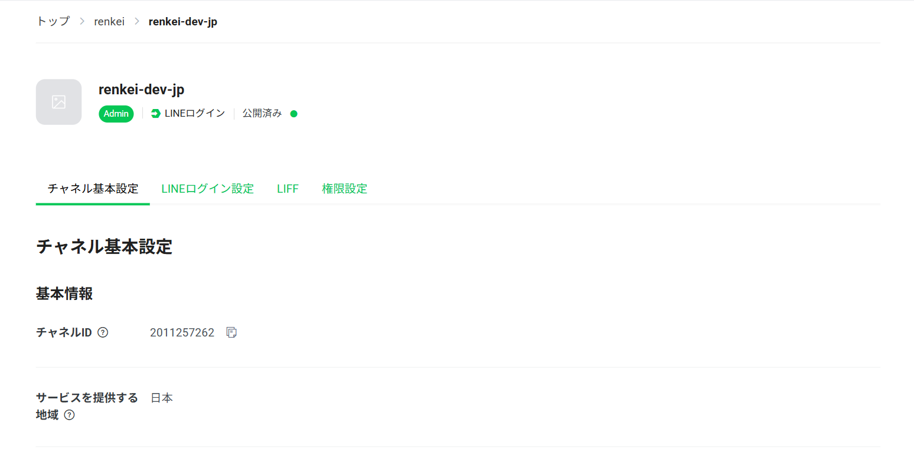
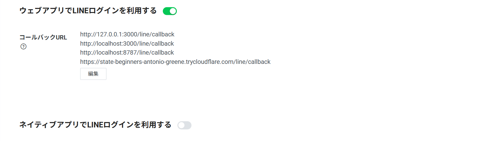
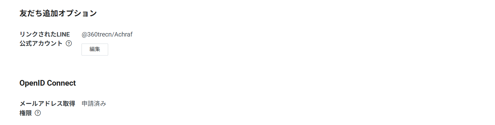
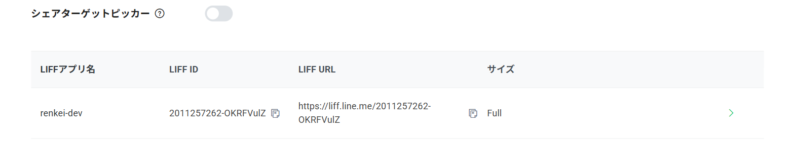
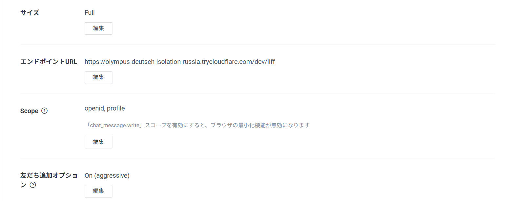

# Setting up the LINE Developers Console

> 日本語: [line-console.ja.md](line-console.ja.md)

What to create on the LINE side before running renkei, and in which order. **The order matters** — channels can never be moved between providers afterwards.

Time: ~20 minutes. You need: a LINE Business ID (an email address is enough), a phone that receives SMS, and the LINE app on a phone for testing.

## The shape

```
Provider (your company / yourself)
 ├─ LINE Login channel        ← what renkei uses; one per country
 │    └─ LIFF app             ← if you build a Mini App / LIFF
 └─ Messaging API channel     ← friend-add and account linking (= LINE Official Account)
        ▲
        └─ linked from the Login channel's "Add friend option"
```

Login, LIFF and Messaging API channels **under the same provider** return the same `userId` for a user.
Under different providers the IDs differ and renkei's ID mapping cannot work. This is the most common mistake.

## 1. Create a provider

[LINE Developers Console](https://developers.line.biz/console/) → **Create a new provider**. Name it after your service (names containing "LINE" are rejected).

## 2. Create a LINE Login channel

Provider → **Create a LINE Login channel**.

| Field | Value |
|---|---|
| Region to provide the service | the country you serve. **Cannot be changed later.** Create one channel per country if you also serve Taiwan / Thailand |
| Channel name | shown on the consent screen (cannot contain "LINE") |
| App types | tick **Web app** |
| Email address | contact |

Then on **Basic settings**:

- Note **Channel ID** and **Channel secret** → `LINE_LOGIN_CHANNEL_ID` / `LINE_LOGIN_CHANNEL_SECRET`
- **LINE Login** tab → add `https://<renkei>/line/callback` to **Callback URL**. During development `http://localhost:3000/line/callback` is fine (plain http is allowed for localhost)





## 3. Create a LINE Official Account (Messaging API channel)

Needed for friend-add (`bot_prompt`) and account linking. You can skip it for login-only, but most of the reason to use renkei lives here.

1. Provider → **Create a Messaging API channel** → you are sent to "Create a LINE Official Account" (it can no longer be created from the console)
2. **SMS verification** is required (once per Business ID)
3. Fill in the Official Account form: account name, industry
4. **LINE Official Account Manager** → first time: an information-use consent → **Settings → Messaging API → Enable Messaging API**
5. **⚠ Provider selection**: the default is "New provider". **Pick the provider from step 1.** A new provider means mismatched user IDs
6. Back in the Developers Console the Messaging API channel appears under your provider

## 4. Link the Official Account to the Login channel

Login channel → **Basic settings** → **Add friend option / Linked LINE Official Account → Edit** → pick the account from step 3 → Update.

Without this, `bot_prompt` is ignored and the friendship API returns 4xx.



## 5. LIFF app (if you build a Mini App / LIFF)

Login channel → **LIFF** tab → **Add**.

| Field | Value |
|---|---|
| Size | Full (as needed) |
| Endpoint URL | **https required**. During development a tunnel URL (`cloudflared tunnel --url http://localhost:3000`). A placeholder URL is accepted at creation |
| Scopes | `openid`, `profile` (`email` once permission is approved) |
| Add friend option | On (aggressive) |

The LIFF ID (`<channelId>-xxxxxxxx`) goes in `LIFF_ID`.





> LINE is folding LIFF into **LINE MINI App** and recommends new apps be created as MINI App channels (Japan, and Taiwan with local approval). Existing LIFF apps keep working. renkei will support both.

## 6. Email permission (if you need email)

Login channel → **Basic settings → OpenID Connect → Email address permission → Apply**.
Tick the two attestations and upload **a screenshot of the screen that tells users what their email is used for** → Submit. Review takes days.

Until approved, LINE **silently drops** the `email` scope. renkei warns at boot when `RENKEI_REQUEST_EMAIL=true`.
If you connect a downstream that requires an email (Supabase), use `placeholderEmailDomain` in the meantime.

## 7. Publish the channel (the Developing-status trap)

New Login channels start as **Developing**. In that state only accounts with a role on the channel can log in; everyone else gets
`400 Bad Request — This channel is now developing status. User need to have developer role.`
**If you log into the console with an email, the LINE account on your phone is *not* an account with a role.**

- For a dev/test channel: **Publish** (the "Developing" badge at the top of Basic settings → Publish). **Irreversible** (recreate to go back)
- For a production channel still in development: invite testers on the **Roles** tab (the invitee accepts by logging into the Developers Console with their LINE account)

## Checklist

- [ ] Login / Messaging API / LIFF are under the **same provider**
- [ ] `${ISSUER}/line/callback` is registered as a Callback URL, **exactly**
- [ ] The Official Account is linked to the Login channel
- [ ] The channel is Published, or you are a tester
- [ ] (if email) email permission is Approved
- [ ] (if LIFF) the Endpoint URL is https and points at a real page

## Common errors

| Error | Cause |
|---|---|
| `400 … developing status` | step 7 |
| `redirect_uri` mismatch | Callback URL not identical (http/https, trailing slash, port) |
| No friend-add screen | missing link from step 4, or no `bot_prompt` passed |
| `line:user_id` differs from the Messaging API userId | different providers (steps 3–5); only fix is recreating |
| No email | permission not approved, or the user declined. Not an error |
